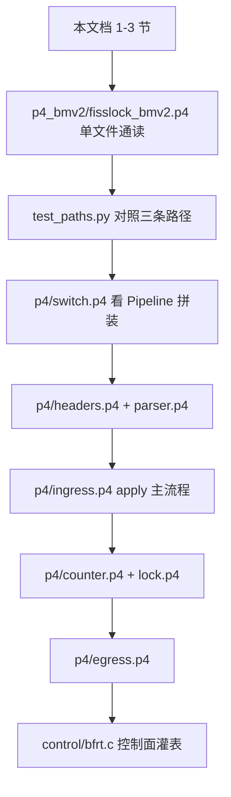

# FissLock 交换机代码 — 新手学习导读

本文档配合 `switch/` 目录下带中文注释的源码阅读。论文：[OSDI'24 FissLock](https://ipads.se.sjtu.edu.cn/_media/publications/fisslock-osdi24.pdf)。

---

## 1. 交换机与 P4 最小概念

### 1.1 数据面 vs 控制面

| 概念 | 含义 | 本仓库对应 |
|------|------|------------|
| **数据面（Data Plane）** | 每个包到达时由硬件/软件交换机**线速**执行的逻辑 | `switch/p4/*.p4`（Tofino）或 `switch/p4_bmv2/fisslock_bmv2.p4`（BMv2 仿真） |
| **控制面（Control Plane）** | 启动交换机、配置端口、灌表、创建组播组 | `switch/control/*.c`、`multicast.txt`、`simple_switch_CLI` |

普通交换机用固定芯片逻辑转发；**可编程交换机**用 **P4** 描述「收到包后做什么」。

### 1.2 P4 流水线四段（简化）


- **Parser**：从比特流里 `extract` 出 `ethernet`、`ipv4`、`udp`、`lock` 等 header。
- **Ingress**：查表、改包头、决定从哪个端口或哪个组播组发出（**锁逻辑主要在这里**）。
- **Egress**：包已决定出口后，可对**组播副本**按 `egress_rid` 再改一次包头。
- **Deparser**：把 header 写回包，计算校验和等。

### 1.3 三个常用构件

| 构件 | 作用 | FissLock 例子 |
|------|------|----------------|
| **table + action** | 按 key 匹配，执行 action | `lock_op_table`：按 (type, mode, free, rw) 选 `new_agent` / `mcast_to_agent` |
| **register** | 片上 SRAM，按索引存每把锁的状态 | `lock_free_reg`：0=空闲 1=已占用 |
| **metadata** | 包处理过程中的临时变量，不随包出交换机 | `meta.agent_changed` |

Tofino 用 **RegisterAction** 原子读改写；BMv2 用 `register.read` / `register.write`。

### 1.4 单播 vs 组播

- **单播**：一个包从一个端口出去 → BMv2 的 `host_fwd` 设 `egress_spec`。
- **组播**：ingress 设 `mcast_grp`，交换机复制多份，每份带 **replica id（egress_rid）** → egress 对 rid=1/2 改成不同 `type` 和 UDP 端口。

---

## 2. FissLock 锁包语义

### 2.1 包格式（与 `lib/post.h` 一致）

UDP payload **17 字节**：

1. `type`（1B）— 消息类型  
2. `mode_old_mode` 等（16B）— 锁 ID、machine_id、agent、ncnt 等  

P4 里对应 `lock_hdr_t`（见 `headers.p4` 或 BMv2 单文件）。

### 2.2 消息类型（type）

| 常量 | 值 | 谁发 | 含义 |
|------|-----|------|------|
| `ACQUIRE` | 0x01 | 客户端 | 申请锁 |
| `GRANT_W_AGENT` | 0x02 | 交换机→客户端 | 授权，且本机成为 **agent**（锁管理者） |
| `GRANT_WO_AGENT` | 0x03 | 交换机→客户端 | 授权，但 agent 在别的主机 |
| `RELEASE` | 0x04 | 客户端 | 释放（共享锁） |
| `TRANSFER` | 0x05 | 客户端 | 转移 agent |
| `FREE` | 0x06 | 客户端 | 释放锁（独占结束） |

### 2.3 UDP 端口

| 端口 | 常量 | 用途 |
|------|------|------|
| 20001 | `UDP_PORT_SERVER` | 发往 agent / 服务器侧处理 |
| 20002 | `UDP_PORT_CLIENT` | 发往普通客户端 |

Parser 对这两个目的端口都会 `parse_lock`。

### 2.4 锁的三种片上状态（每把锁）

| 寄存器 | 含义 |
|--------|------|
| `lock_free` | 0=空闲，1=已被 acquire |
| `lock_rw` | 0=shared，1=exclusive |
| `lock_agent` | 当前负责管理该锁的 host_id |
| `notification_cnt` | 共享锁通知计数，与包内 `ncnt` 配合 |

**锁裂变（Lock Fission）**：交换机只做「是否授权、agent 是谁」的快速决策；复杂队列等由 agent 主机维护。

---

## 3. 三条核心数据面路径

与 `p4_bmv2/README.md` 及 `test/test_paths.py` 一致。

### 路径 1：锁裂变状态机

1. 客户端发 `ACQUIRE`（独占或共享）。  
2. `do_acquire` / `acquire_table` 把 `lock_free` 置为已占用。  
3. `rw_table` 设置或读取 shared/excl。  
4. `lock_op_table`：若锁原先空闲 → `new_agent`（授权 + 本机为 agent）；若已 shared 且再次 ACQUIRE → `mcast_to_agent` 或 `fwd_to_agent`。

**BMv2 测试**：`lock_id=1`，独占 ACQUIRE → port1 收到 `GRANT_W_AGENT`，dport=20002。

### 路径 2：Counter 一致性

共享锁下，每次 `ACQUIRE` 使交换机 `notification_cnt++`。  
`TRANSFER` / `FREE` 时，包内 `ncnt` 必须与交换机计数**一致**才允许 `transfer_agent`；否则认为网中还有旧包在飞，**跳过** agent 更新（`agent_changed=0`）。

**BMv2 测试**：先 ACQUIRE shared；`TRANSFER` 且 `ncnt=0` 失败；`ncnt=1` 成功 grant。

### 路径 3：共享锁组播授权

锁已是 **shared** 且再次被 ACQUIRE → `mcast_to_agent`，ingress 设组播。  
- **BMv2**：组 `299`，egress rid=1 → agent 见 `ACQUIRE`+`granted`；rid=2 → client 见 `GRANT_WO_AGENT`。  
- **Tofino**：`mcast_grp_a` = agent，`mcast_grp_b` = dest2+128，双组播 + egress 改包。

---

## 4. 拓扑

### 4.1 BMv2（无硬件）

```
port 0 ← veth-switch / 测试从 veth-inject 注入
port 1 ← veth-h1（常作 host_id=1，agent）
port 2 ← veth-h2（常作 host_id=2，client）
```

### 4.2 Tofino 实验集群

每台机器在 [`control/cluster.h`](control/cluster.h) 中一行：

`{ 主机名, IP, MAC, 交换机端口号 }`

控制面 `bfrt.c` 的 `driver_init()` 把 MAC→端口写入 `eth_fallback`，并创建组播组 1–255。

---

## 5. 阅读路线图



---

## 6. BMv2 ↔ Tofino 文件对照表

| 功能 | BMv2 | Tofino |
|------|------|--------|
| 入口 | `fisslock_bmv2.p4` `V1Switch` | `switch.p4` `Switch(pipe)` |
| 包头定义 | 文件内 `lock_hdr_t` | `headers.p4` |
| 解析 | `Parser` | `parser.p4` `IngressParser` |
| 空闲/RW 寄存器 | `lock_free_reg` / `lock_rw_reg` | `ingress.p4` `Register` + `RegisterAction` |
| 通知计数 | `counter_table` | `counter.p4` `CounterTable_1/2/3` |
| 状态机 | `lock_op_table` | `lock.p4` `lock_operation_1/2/3` |
| 组播 | `mcast_grp=299` | `mcast_grp_a` + `mcast_grp_b` |
| 单播 | `host_fwd` | 组播 id=0 时 TM 丢副本，等效单播 |
| Egress 改包 | `egress_rid` 1/2 | `egress.p4` 同逻辑 |
| 锁数量 | 1024（id 高 22 位须为 0） | 3×2^19（按 id[31:19] 分 stage） |
| 控制面 | `multicast.txt` + CLI | `bfrt.c` + `run_decider.sh` |

---

## 7. 文件索引（注释完成情况）

| 文件 | 说明 |
|------|------|
| `LEARNING_zh.md` | 本文档 |
| `p4_bmv2/fisslock_bmv2.p4` | BMv2 全注释 |
| `p4_bmv2/test/test_paths.py` | 测试说明 |
| `p4_bmv2/setup/multicast.txt` | 组播 CLI |
| `p4_bmv2/scripts/start_switch.sh` 等 | 脚本头注释 |
| `p4/switch.p4` | Pipeline 入口 |
| `p4/headers.p4` | 协议与锁头 |
| `p4/parser.p4` | 解析与 Deparser |
| `p4/counter.p4` | 通知计数 |
| `p4/lock.p4` | 裂变状态机 |
| `p4/ingress.p4` | Ingress 主控 |
| `p4/egress.p4` | 组播副本改包 |
| `control/cluster.h` | 集群机器表 |
| `control/bfrt.h` / `bfrt.c` / `main.c` | BFRT 控制面 |
| `configure_p4.sh` / `run_decider.sh` / `port-setup.bfsh` | 构建与运行 |

---

## 8. 延伸阅读

- P4 语言：<https://p4.org/>
- BMv2：`switch/p4_bmv2/DEPLOY_UBUNTU.md`
- 主机侧锁 API：`lib/post.h`
